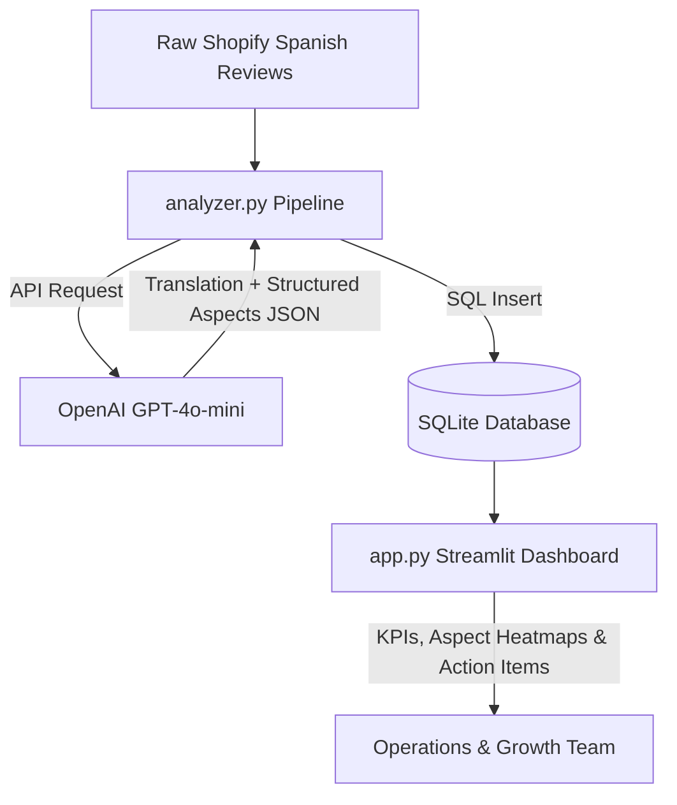

# Voice of the Customer (VoC) & Product Improvement Engine for Bloody Green

This portfolio project simulates a modern e-commerce data pipeline designed to parse, translate, and analyze customer product reviews for **Bloody Green** (bloodygreen.cl), a D2C startup selling period underwear in Chile. 

By building this project, you demonstrate:
- **Multilingual Data Engineering:** Processing localized Spanish reviews and translating/structuring them for global corporate dashboards.
- **AI-Powered Aspect Sentiment Analysis:** Extracting granular customer signals (e.g., separating comments about *sizing* from comments about *absorbency* or *comfort*).
- **Business Intelligence & Operations:** Generating automated product action items (e.g., identifying if a specific style runs small or has leakage concerns) to drive inventory and GTM decisions.

---

## System Architecture



---

## File Structure

- **`README.md`**: Guide and architecture details.
- **`mock_reviews.py`**: Rich dataset of Spanish customer reviews matching real Bloody Green models (*Bikini Intenso*, *High Waist Moderado*, *Colaless*, etc.) and database initialization.
- **`analyzer.py`**: Script to process the Spanish reviews, run OpenAI aspect-extraction, and save the structured outputs.
- **`app.py`**: Streamlit BI dashboard displaying VoC analytics and automated operations action items.

---

## Setup & Running the Project

### 1. Install Dependencies
Make sure Python is installed. Run the following command:
```bash
python3 -m pip install streamlit pandas plotly openai
```

### 2. Launch the Dashboard (With Pre-compiled Database)
The database will be automatically initialized when you start the app:
```bash
python3 -m streamlit run app.py
```
This will open the dashboard in your default browser.

### 3. Run Live Analysis Pipeline
To analyze reviews using live API keys:
1. Set your OpenAI key:
   ```bash
   export OPENAI_API_KEY="your-openai-api-key"
   ```
2. Run the analyzer script to process any new reviews:
   ```bash
   python3 analyzer.py
   ```
3. Refresh the Streamlit dashboard to see the results.
